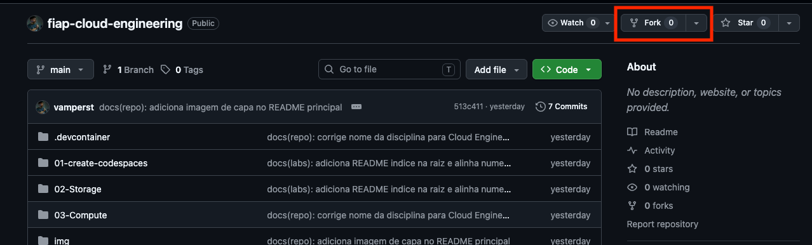
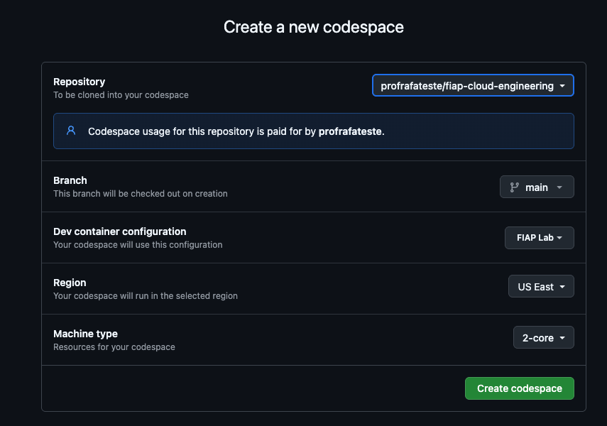
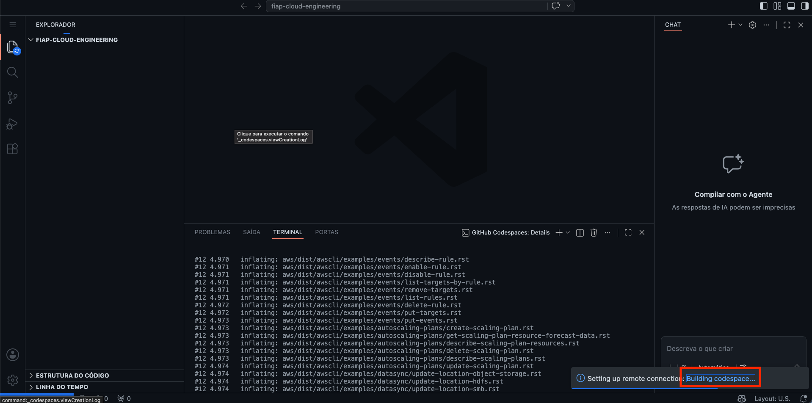
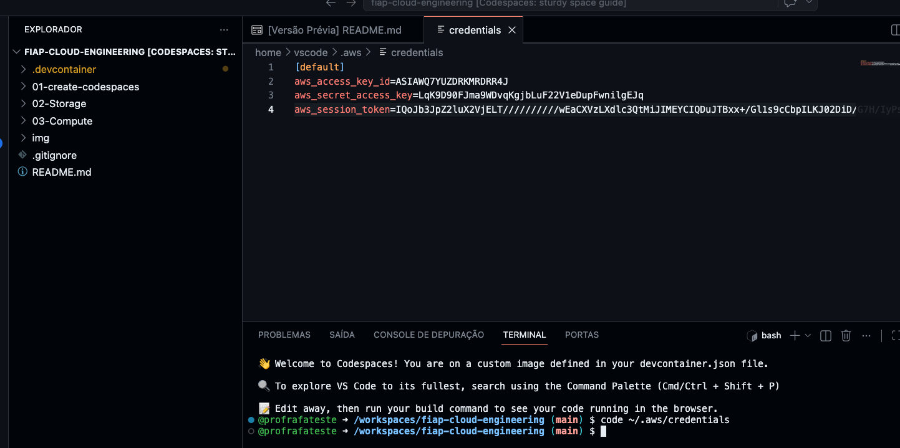
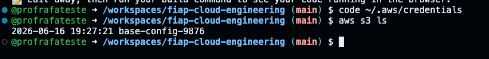

# 01 - Setup e configuração de ambiente

Este é o **setup único** da disciplina. Você executa uma vez e tem tudo pronto para os laboratórios. Depois deste setup, antes de cada aula, siga o ritual rápido do [01.1 - Início de toda aula](./Inicio-de-aula.md).

> [!WARNING]
> **Pré-requisitos — confira antes de começar:**
>
> - [ ] Conta no [github.com](https://github.com) ativa (se não tem, crie agora — leva 1 minuto).
> - [ ] Acesso ao email institucional `rm<SEU_RM>@fiap.com.br` via [webmail.fiap.com.br](http://webmail.fiap.com.br/).
> - [ ] Navegador moderno (Chrome, Firefox ou Edge — evite Safari no macOS para o Codespaces).
>
> **O que você vai fazer:** fazer fork do repositório, criar um Codespaces conectado a ele, ativar a conta do AWS Academy Learner Lab, criar um bucket S3 permanente e copiar credenciais da AWS para dentro do Codespaces. **Tempo estimado: 30 minutos** (15-20 min ociosos esperando o Codespaces terminar de criar).

Você vai combinar **duas ferramentas** ao longo da disciplina:

1. **Conta AWS via AWS Academy** — conta provisionada pela FIAP com $50 de crédito, renovada a cada 4 horas de sessão.
2. **GitHub Codespaces** — IDE online idêntica para todos os alunos, com Terraform, Docker e AWS CLI já instalados.

Os laboratórios assumem esse par funcionando. Sem o setup completo, os comandos do primeiro lab já falham.

## Principais pontos de aprendizagem

- Por que usar Codespaces em vez de configurar o ambiente local (reprodutibilidade e suporte em sala).
- Como funciona o **ciclo de 4 horas** das credenciais da AWS Academy.
- Por que o bucket `base-config-<SEU_RM>` é permanente e os demais recursos são efêmeros.

## O que você terá ao final

Um Codespaces rodando com credenciais AWS ativas, bucket S3 permanente criado, e o comando `aws s3 ls` respondendo sem erro. A partir daí, você está pronto para o [Lab 02.1 - Network File System (EFS)](../02-Storage/01-Network-file-system/README.md).

> [!TIP]
> Os blocos `<details><summary>💡 Clique para entender</summary>` aprofundam conceitos. Pule se estiver com pressa.

## Mapa do setup

| # | Parte | O que acontece | Tempo |
|---|-------|---------------|-------|
| 1 | [GitHub Codespaces](#parte-1---github-codespaces) | Fork do repo e criação do Codespaces (2-core, region US East). | ~10 min (espera) |
| 2 | [Conta AWS Academy](#parte-2---conta-aws-academy) | Ativar email FIAP, aceitar convite, iniciar o Learner Lab. | ~10 min |
| 3 | [Bucket S3 permanente](#parte-3---bucket-s3-permanente) | Criar `base-config-<SEU_RM>` no console AWS. | ~2 min |
| 4 | [Credenciais no Codespaces](#parte-4---credenciais-no-codespaces) | Copiar credenciais temporárias para `~/.aws/credentials`. | ~5 min |

<details>
<summary><b>💡 Por que tanta ferramenta só para um lab AWS? (abra se quiser entender a escolha)</b></summary>
<blockquote>

O par **Codespaces + AWS Academy** resolve três problemas simultâneos:

1. **Reprodutibilidade.** Todo aluno tem o mesmo Ubuntu, mesmo Terraform, mesmo AWS CLI, mesma versão de Docker. Zero "funciona na minha máquina".
2. **Custo zero fora da sala.** AWS Academy dá uma conta com $50 de crédito e janelas de 4 horas; Codespaces tem 120h/mês gratuitas para estudantes. Nenhum cartão de crédito em lugar nenhum.
3. **Suporte prático.** Quando algo quebra, o professor consegue reproduzir **exatamente** o que o aluno está vendo — rodando o mesmo repo no mesmo ambiente. Isso acelera MUITO debugar erros.

Alternativas (máquina local, conta AWS pessoal, cloud shell da AWS) funcionam, mas não têm esse balanço de custo + reprodutibilidade + suporte.

</blockquote>
</details>

---

## Parte 1 - GitHub Codespaces

### Resultado esperado desta parte

Um Codespaces chamado `fiap-cloud-engineering` rodando na sua conta, com o repositório já clonado e um terminal pronto.

1. Acesse o repositório da disciplina: [fiap-cloud-engineering](https://github.com/vamperst/fiap-cloud-engineering).

2. Clique no botão `Fork` no canto superior direito para copiar o repositório para a sua conta.

<!-- PRINT SUGERIDO: img/fork1.png
     Botão Fork destacado no cabeçalho do repositório original. -->


3. Na tela de criação do fork, **deixe `Copy the main branch only` marcado** e clique em `Create Fork`.

<details>
<summary><b>💡 Por que fork em vez de clonar?</b></summary>
<blockquote>

O fork te dá uma cópia independente que pode receber seus commits sem afetar o original. Durante a disciplina você vai editar arquivos (`state.tf`, scripts) dentro desse fork. No início de cada aula, o ritual do [Inicio-de-aula.md](./Inicio-de-aula.md) **sincroniza** o seu fork com o repo original para você pegar novos labs — sem perder suas alterações locais.

</blockquote>
</details>

4. Acesse [github.com/codespaces](https://github.com/codespaces) e clique em `Get Started for free` (se for sua primeira vez) ou em `New codespace`.

<!-- PRINT SUGERIDO: img/codespaces1.png
     Página inicial do GitHub Codespaces com o botão "Get Started" à vista. -->


5. Clique em `New codespace` no canto superior direito.

<!-- PRINT SUGERIDO: img/codespaces2.png
     Tela de listagem de Codespaces com o botão "New codespace" destacado. -->


6. Preencha o formulário **exatamente** como abaixo e clique em `Create Codespace`:

| Campo | Valor |
|-------|-------|
| Repository | `fiap-cloud-engineering` |
| Branch | `main` |
| Dev container configuration | `FIAP Lab` |
| Region | `US East` |
| Machine type | `2-core` |

<!-- PRINT SUGERIDO: img/codespaces3.png
     Formulário de criação do Codespaces com todos os campos preenchidos. -->


> [!NOTE]
> A criação do Codespaces demora **de 10 a 15 minutos** na primeira vez — ele precisa baixar o dev container (FIAP Lab), Terraform, Docker e AWS CLI. Nas próximas vezes, reabrir o mesmo Codespaces leva menos de 1 minuto.

7. Enquanto o Codespaces constrói, clique em `Building codespace` no canto inferior direito para acompanhar os logs.

<!-- PRINT SUGERIDO: img/codespaces4.png
     Indicador "Building codespace" com logs abertos mostrando o progresso. -->


> [!TIP]
> **Deixe a aba do Codespaces aberta** e avance para a Parte 2 em paralelo — os 10 minutos de build são tempo ocioso que você pode usar para configurar a AWS Academy.

### Checkpoint

- [x] Fork criado na sua conta GitHub.
- [x] Codespaces `fiap-cloud-engineering` em estado `Running` (ou ainda `Building` — ok para seguir).

---

## Parte 2 - Conta AWS Academy

### Resultado esperado desta parte

Conta AWS Academy ativa com o `Learner Lab` iniciado e a bolinha verde ao lado de "AWS" no topo da tela.

8. Se ainda **não tem conta** no AWS Academy:
   1. Acesse seu email FIAP em [webmail.fiap.com.br](http://webmail.fiap.com.br/). Seu endereço é `rm<SEU_RM>@fiap.com.br` e a senha é a mesma dos portais.
   2. Procure um email de convite do Academy na caixa de entrada e siga as instruções.
   3. Ao entrar no Academy, aparecerá uma turma chamada `AWS Academy Learner Lab`. Clique em `Enroll` para aceitar.

9. Para entrar em uma conta **já existente**, acesse [awsacademy.com/LMS_Login](https://www.awsacademy.com/LMS_Login).

10. Dentro da plataforma, clique em `Cursos` na lateral esquerda e selecione o curso da disciplina atual.

<!-- PRINT SUGERIDO: img/academy1.png
     Dashboard do AWS Academy com o curso da disciplina selecionado. -->


11. Dentro do curso, clique em `Módulos` na lateral esquerda.

<!-- PRINT SUGERIDO: img/academy2.png
     Lateral do curso com o item "Módulos" destacado. -->


12. Clique em `Iniciar os laboratórios de aprendizagem da AWS Academy`.

<!-- PRINT SUGERIDO: img/academy3.png
     Link "Iniciar os laboratórios de aprendizagem" à vista. -->


13. No primeiro acesso, vão aparecer **dois termos de consentimento** para aceitar. Role até o fim de cada um e clique em `I agree`. Se você já tinha aceito em aulas anteriores, pule para o passo 15.

<!-- PRINT SUGERIDO: img/academy4.png
     Tela de termos de uso do AWS Academy antes do "I agree". -->


14. Clique no link que começa com `Academy-CUR` para acessar a conta AWS. Se pedir consentimento adicional, clique em `I agree` e repita.

<!-- PRINT SUGERIDO: img/academy8.png
     Link Academy-CUR à vista dentro do módulo. -->


15. Esta é a tela de sessão: **cada sessão dura 4 horas**. Após esse tempo, você precisa iniciar uma sessão nova — mas os recursos criados na conta AWS **persistem até o final do curso**. Clique em `Start Lab`.

<!-- PRINT SUGERIDO: img/academy5.png
     Tela do Learner Lab com o botão "Start Lab" antes de iniciar. -->


<!-- PRINT SUGERIDO: img/academy6.png
     Tela do Learner Lab com o "Start Lab" em progresso (bolinha amarela). -->


16. Aguarde a bolinha ao lado de "AWS" no canto superior esquerdo ficar **verde**. Depois clique em `AWS` para abrir o console em uma nova aba.

<!-- PRINT SUGERIDO: img/academy7.png
     Bolinha verde do AWS ativa e botão AWS clicável. -->


### Checkpoint

- [x] Conta AWS Academy ativa com o Learner Lab iniciado.
- [x] Bolinha `AWS` verde no topo da página.
- [x] Console AWS aberto em uma nova aba.

<details>
<summary><b>⚠ Se der erro: a bolinha fica amarela por mais de 5 minutos</b></summary>
<blockquote>
Clique em `End Lab` e depois em `Start Lab` novamente. Às vezes a primeira tentativa falha silenciosamente. Se persistir depois de 3 tentativas, abra uma issue no GitHub com o screenshot da tela.
</blockquote>
</details>

---

## Parte 3 - Bucket S3 permanente

### Resultado esperado desta parte

Um bucket `base-config-<SEU_RM>` criado no S3, em `us-east-1`, vazio.

Este bucket é **permanente** durante toda a disciplina — ele guarda o estado do Terraform dos laboratórios. Criá-lo uma vez aqui evita reprovisionar a cada lab.

17. No console AWS (aberto no passo 16), abra o [serviço S3](https://us-east-1.console.aws.amazon.com/s3/home?region=us-east-1#).

18. Clique em `Criar bucket`.

<!-- PRINT SUGERIDO: img/s3CreateBucket.png
     Tela do S3 com o botão "Criar bucket" destacado. -->


19. Preencha **apenas** o nome do bucket como `base-config-<SEU_RM>` (substitua `<SEU_RM>` pelo seu RM, sem caracteres especiais ou espaços). Deixe todo o resto no padrão e clique em `Criar`.

<!-- PRINT SUGERIDO: img/createBucket.png
     Formulário de criação do bucket com o nome "base-config-<RM>" preenchido. -->


> [!IMPORTANT]
> **Use exatamente o formato `base-config-<RM>`** — todos os scripts dos labs detectam o bucket pelo prefixo `base-config-` via `aws s3 ls | awk '/base-config-/'`. Um nome diferente quebra todos os labs subsequentes.

### Checkpoint

- [x] Bucket `base-config-<SEU_RM>` aparece na lista do S3.
- [x] Região do bucket é `us-east-1 (N. Virginia)`.

---

## Parte 4 - Credenciais no Codespaces

### Resultado esperado desta parte

Arquivo `~/.aws/credentials` preenchido dentro do Codespaces, e `aws s3 ls` listando o bucket que você criou na Parte 3.

20. Volte para a aba do Codespaces. Se ele terminou de construir, você verá uma interface parecida com VS Code online.

21. Abra o terminal se não estiver visível (`Terminal` → `New Terminal` na barra superior).

22. Abra o arquivo de credenciais do AWS CLI:

```bash
code ~/.aws/credentials
```

Ele vai abrir **vazio** — é isso mesmo. O Codespaces não tem credenciais AWS por padrão.

23. Na aba do AWS Academy (onde você fez `Start Lab`), clique em `AWS Details` no canto superior direito e depois em `Show` na seção `AWS CLI`.

<!-- PRINT SUGERIDO: img/codespaces6.png
     Botão "AWS Details" e seção "AWS CLI" com o "Show" antes de clicar. -->


24. Copie o conteúdo das credenciais (selecione tudo, `Ctrl+C` ou `Cmd+C`).

<!-- PRINT SUGERIDO: img/codespaces7.png
     Bloco de credenciais temporárias exibido após clicar em Show. -->


25. Volte ao Codespaces, cole no arquivo `credentials` aberto e salve (`Ctrl+S` ou `Cmd+S`).

<!-- PRINT SUGERIDO: img/codespaces8.png
     Arquivo credentials salvo no Codespaces com as credenciais coladas. -->


26. Teste a configuração — este comando é o **checkpoint final** do setup inteiro:

```bash
aws s3 ls
```

Saída esperada: pelo menos uma linha com o bucket `base-config-<SEU_RM>` que você criou na Parte 3.

<!-- PRINT SUGERIDO: img/codespaces9.png
     Terminal do Codespaces mostrando "aws s3 ls" retornando o bucket base-config-<RM>. -->


> [!WARNING]
> **As credenciais da AWS Academy duram 4 horas e precisam ser recopiadas em cada aula.** Se você fechar o Codespaces e abrir de novo dias depois, o `aws s3 ls` vai falhar com erro de autenticação — basta repetir os passos 23-25 para renovar.

> [!CAUTION]
> **SEMPRE DESLIGUE o Codespaces ao final da aula** para não consumir as 120h/mês gratuitas. Acesse [github.com/codespaces](https://github.com/codespaces), clique nos 3 pontinhos ao lado do ambiente e selecione `Stop Codespace`.

<!-- PRINT SUGERIDO: img/codespaces10.png
     Menu de 3 pontos do Codespaces com a opção "Stop Codespace" destacada. -->


### Checkpoint

- [x] `~/.aws/credentials` preenchido.
- [x] `aws s3 ls` responde sem erro e lista o bucket `base-config-<SEU_RM>`.

---

## Conclusão

Você agora tem três peças funcionando juntas: fork do repositório com os labs, Codespaces construído com todas as ferramentas, e credenciais AWS válidas por 4 horas. A partir daqui, cada início de aula é um ritual curto de 2-3 minutos (sync do fork + renovação de credenciais) descrito em [01.1 - Início de toda aula](./Inicio-de-aula.md).

## Próximo passo

Siga direto para o [Lab 02.1 - Network File System (EFS)](../02-Storage/01-Network-file-system/README.md). Ele é o primeiro laboratório prático da disciplina e usa o bucket `base-config-<SEU_RM>` que você acabou de criar.

---

<details>
<summary><b>💡 Glossário rápido</b></summary>
<blockquote>

| Termo | O que é |
|-------|---------|
| Fork | Cópia independente de um repositório Git na sua conta, que pode receber seus commits. |
| Codespaces | IDE cloud do GitHub baseada em VS Code, com ambiente pré-configurado via dev container. |
| Dev container | Definição Docker do ambiente de desenvolvimento, versionada no próprio repositório. |
| AWS Academy | Programa educacional da AWS que dá acesso a uma conta real por período limitado. |
| Learner Lab | Tipo de laboratório do Academy com sessão de 4 horas e $50 de crédito. |
| `~/.aws/credentials` | Arquivo padrão onde o AWS CLI busca chaves temporárias/permanentes. |
| Bucket S3 | Container raiz de objetos no S3, identificado por nome globalmente único. |
| `us-east-1` | Região AWS em N. Virginia, a mais comum para laboratórios (preço e disponibilidade). |

</blockquote>
</details>

<details>
<summary><b>💡 Como pedir ajuda se travou</b></summary>
<blockquote>

**Antes de abrir issue ou chamar o professor, colete:**

1. Em qual parte (1, 2, 3 ou 4) travou e em qual passo.
2. A mensagem de erro **literal** (copie e cole, não resuma).
3. Screenshot da tela onde o erro apareceu.
4. Sistema operacional e navegador que está usando.

**Canais, em ordem:**

1. [Issues deste repositório](https://github.com/vamperst/fiap-cloud-engineering/issues) — preferido, cria histórico pesquisável.
2. Email do professor com os 4 itens acima.
3. Na sala de aula, durante a próxima aula.

</blockquote>
</details>
